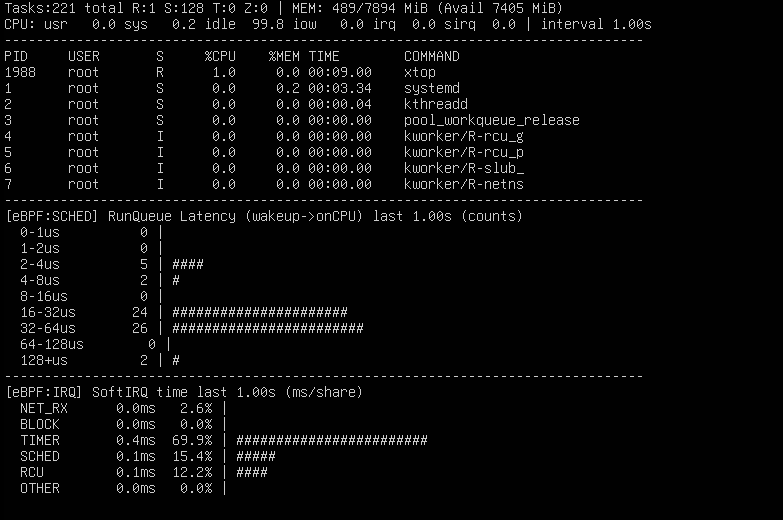

# xtop

`xtop-bpf`는 리눅스의 `top`과 유사한 시스템 모니터링 도구에  
eBPF 기반 커널 트레이싱 기능을 확장하여 만든 프로젝트입니다.

기존 top처럼 CPU 사용률을 출력하고,  
커널 내부에서 발생하는 스케줄링 지연과 interrupt 오버헤드까지 함께 관측할 수 있습니다.  

<br>

## Overview   

  

- 프로세스 CPU 사용률 모니터링  
- 스케줄러 RunQueue 지연(runqlat) 히스토그램 시각화  
- SoftIRQ 벡터별 커널 CPU 사용 시간 분해 출력  

기본 설정으로는 1초 주기로 화면이 갱신되며, 실시간으로 커널 이벤트의 변화를 관측할 수 있습니다.  


<br>


## Environment

- Linux Kernel: 6.8.0
- OS : Ubuntu Server 24.04.3 LTS

<br>


## Build

필수 패키지 
```sh
sudo apt-get install -y clang llvm libbpf-dev bpftool libelf-dev zlib1g-dev linux-tools-common linux-tools-$(uname -r)
```

빌드
```sh
sudo make
```
<br>

## Run

```sh
sudo ./xtop
```

Option  
```sh
-d <sec>   Refresh interval (default: 1)
-n <N>     Number of updates before exit (0=forever)
-b         Batch mode (no screen clear)
-k <N>     Show top N processes (default: 20)
-o <key>   Sort by: cpu|mem|time|pid (default: cpu)
-p <pid>   Show only specific PID
```

<br>

## References

This project was developed with inspiration from the following resources:

- Linux `top` / `procps` source code  
  https://gitlab.com/procps-ng/procps

- The Linux `/proc` filesystem documentation  
  https://docs.kernel.org/filesystems/proc.html

- eBPF and libbpf official documentation  
  https://docs.kernel.org/bpf/

- BPF CO-RE (Compile Once, Run Everywhere) reference  
  https://nakryiko.com/posts/bpf-core-reference-guide/

- `bpftool` and BTF usage examples  
  https://github.com/libbpf/bpftool

- eunomia-bpf tutorial repository (practical eBPF examples)  
  https://github.com/eunomia-bpf/bpf-developer-tutorial

- Brendan Gregg’s eBPF tracing tools and methodology  
  https://github.com/iovisor/bcc
  https://www.brendangregg.com/ebpf.html